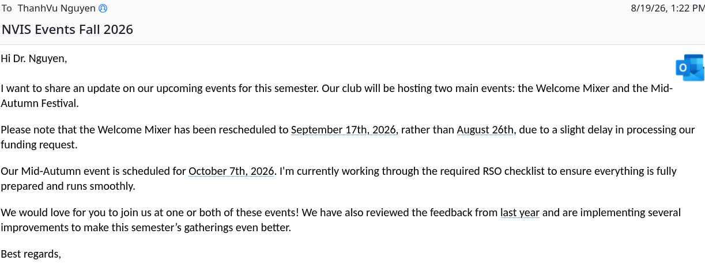
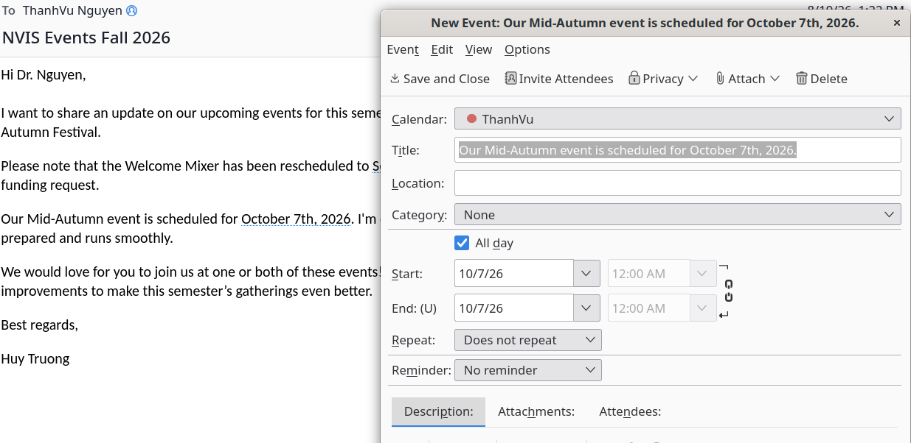

# Date2Cal — Thunderbird add-on

Detects dates and times in an email and turns them into calendar events with
one click, the way macOS Mail does. Click a highlighted date inline, use the
calendar button in the message toolbar for a ranked list of everything
detected, or select any text and right-click "Create event from selection" —
every path opens Thunderbird's own New Event dialog, prefilled but never
saved silently.

It also recognizes recurring events ("every Monday", "weekly", "daily until
Dec 1") and video-call links (Zoom/Teams/Meet/Webex), and has an options page
for the default calendar, default event length, date order (MDY/DMY), and
whether a bare hour like "at 4" means 4 PM.

[Watch the screencast](images/screenshots/screencast.mp4)

Licensed under MPL-2.0 — see `LICENCE`. See `BUILD.md` for build and install
instructions, and `ARCHITECTURE.md` for how the detection engine and
Experiment API bridge fit together.
